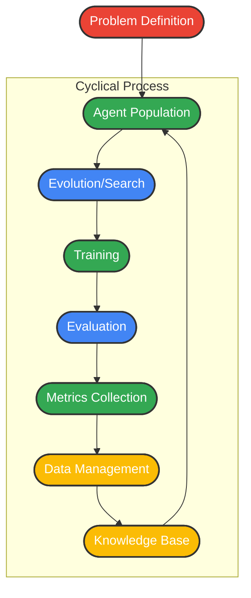

# LLM Trainer Framework

A modular framework for creating and evolving LLM-based agents that solve complex problems through iterative improvement, self-play, and evolutionary algorithms. LLM Trainer provides a flexible architecture for research and development in agent-based problem solving, optimization, and AI evolution.

---

## Table of Contents
- [Overview](#overview)
- [Core Architecture Components](#core-architecture-components)
- [Data Flow Architecture](#data-flow-architecture)
- [Key Design Principles](#key-design-principles)
- [Success Metrics](#success-metrics)
- [Example Use Cases](#example-use-cases)
- [Getting Started](#getting-started)
- [Contributing](#contributing)
- [License](#license)

---

## Overview
LLM Trainer (llm-trainer) is designed to support:
- Defining and decomposing complex problems
- Evolving and training LLM-based agents
- Benchmarking and evaluating agent performance
- Scalable, extensible, and reproducible research

> **Status**: This project is currently in development. APIs may change significantly between versions.

### Why LLM Trainer?
Traditional AI systems often struggle with complex, open-ended problems that require creative thinking, adaptation, and exploration of large solution spaces. LLM Trainer addresses these challenges by combining:

* **Evolutionary computation** - Explore diverse solution spaces efficiently
* **LLM capabilities** - Leverage large language models' reasoning and generative abilities
* **Self-play mechanisms** - Develop increasingly sophisticated strategies through competition
* **Meta-learning** - Learn how to learn and adapt to new problem domains

## Core Architecture Components

### Problem Definition Layer
**Purpose**: Define and structure problems for LLM agents to solve

**Key Interfaces**:
- `ProblemSpec` - Abstract problem definition with constraints and objectives
- `EvaluationMetrics` - Success criteria and scoring functions
- `ProblemDecomposer` - Break complex problems into sub-problems

**Expectations**:
- Support various problem types (optimization, reasoning, creative tasks)
- Configurable evaluation criteria
- Hierarchical problem decomposition
- Domain-specific problem templates

### LLM Agent System
**Purpose**: Intelligent agents that interact with problems and learn solutions

**Key Interfaces**:
- `BaseAgent` - Core agent with reasoning capabilities
- `AgentMemory` - Short/long-term memory management
- `ToolRegistry` - Available tools and functions for agents
- `MultiAgentCoordinator` - Manage agent interactions

**Expectations**:
- Plugin architecture for different LLM backends (OpenAI, Anthropic, local models)
- Persistent memory across episodes
- Tool calling and external API integration
- Communication protocols between agents
- State serialization/deserialization

### Evolution Engine
**Purpose**: Evolve solutions through genetic algorithms and population dynamics

**Key Interfaces**:
- `Population` - Manage candidate solutions
- `FitnessEvaluator` - Score solution quality
- `SelectionStrategy` - Choose parents for reproduction
- `MutationOperator` - Modify existing solutions
- `CrossoverOperator` - Combine solutions

**Expectations**:
- Multiple evolution strategies (genetic, differential evolution, etc.)
- Configurable population size and generations
- Elitism and diversity preservation
- Parallel fitness evaluation
- Solution genealogy tracking

### Search & Optimization
**Purpose**: Systematic exploration of solution spaces

**Key Interfaces**:
- `MCTSNode` - Tree search state representation
- `SearchPolicy` - Guide exploration vs exploitation
- `RewardEstimator` - Value function approximation
- `ExperienceBuffer` - Store search trajectories

**Expectations**:
- MCTS with neural network guidance
- Upper Confidence Bounds (UCB) selection
- Progressive widening for continuous spaces
- Parallelizable search operations
- Integration with evolution engine

### Training Infrastructure
**Purpose**: Continuous improvement of agent capabilities

**Key Interfaces**:
- `TrainingLoop` - Main training orchestration
- `RewardModel` - Learn from human feedback
- `CurriculumManager` - Progressive difficulty
- `CheckpointManager` - Model versioning

**Expectations**:
- Self-supervised learning from solution attempts
- Reinforcement learning from environment feedback
- Imitation learning from expert demonstrations
- Distributed training across multiple GPUs/nodes
- Incremental model updates

### Evaluation & Benchmarking
**Purpose**: Measure and compare agent performance

**Key Interfaces**:
- `BenchmarkSuite` - Standardized test problems
- `MetricsCollector` - Performance data gathering
- `Comparator` - Statistical analysis tools
- `ReportGenerator` - Visualization and reporting

**Expectations**:
- Automated testing pipelines
- Statistical significance testing
- Performance regression detection
- Multi-dimensional evaluation (accuracy, efficiency, creativity)
- Integration with MLOps tools

### Data Management
**Purpose**: Handle training data, experiences, and knowledge

**Key Interfaces**:
- `DatasetManager` - Training data organization
- `ExperienceDB` - Store agent interactions
- `KnowledgeGraph` - Structured domain knowledge
- `SolutionArchive` - Historical solution storage

**Expectations**:
- Scalable data storage (local files, databases, cloud)
- Data versioning and lineage tracking
- Efficient querying and retrieval
- Data quality monitoring
- Privacy and security compliance

### Orchestration Layer
**Purpose**: Coordinate experiments and manage resources

**Key Interfaces**:
- `ExperimentManager` - Run and track experiments
- `ResourceScheduler` - Compute resource allocation
- `ConfigManager` - Hyperparameter management
- `MonitoringService` - System health and metrics

**Expectations**:
- Experiment reproducibility
- Resource optimization and auto-scaling
- Real-time monitoring and alerting
- Integration with cloud platforms
- Cost tracking and optimization

## Data Flow Architecture

The framework follows a cyclical flow where:
1. Problems are defined and structured
2. Agent populations attempt solutions
3. Evolution and search mechanisms improve solution quality
4. Training refines agent capabilities
5. Evaluation provides feedback
6. Data management preserves knowledge for future iterations

## Key Design Principles

- **Modularity**: Each component is independently replaceable
- **Scalability**: Horizontal scaling across distributed systems
- **Extensibility**: Plugin architecture for new algorithms/models
- **Reproducibility**: Deterministic experiments with version control
- **Efficiency**: Parallel processing and resource optimization

## Success Metrics

- **Performance**: Solution quality on benchmark problems
- **Efficiency**: Time and compute resources required
- **Generalization**: Transfer learning to new problem domains
- **Scalability**: Performance with increasing problem complexity
- **Robustness**: Stability across different configurations

---

## Getting Started

TODO : ElodinLaarz - Later.

## Contributing

I'm just doing this for fun. I will probably forget this exists in
two weeks.

I would just fork it and use it elsewhere.

## License

This project is licensed under the terms of the [MIT License](LICENSE).
